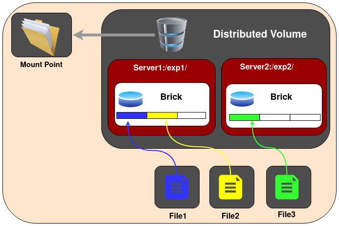

# Anton Kubernetes Storage
Persistent Storage deployment in your Kubernetes cluster



## Quick-start

1. Get a Kubernetes cluster working and have your `kubectl` successfully configured

2. Run the setup daemonset script **WARNING: this will delete any previous setup**

```bash
cd ./scripts
./setupSimpleGlusterDaemonset.sh
```

## Development

1. Build the docker image

```bash
./dockerBuild.sh
```

2. Run the development container

```bash
./runDockerDev.sh
```

3. Setup a 3 node minikube cluster

```bash
minikube start --nodes 3 --kubernetes-version=v1.23.12
```

